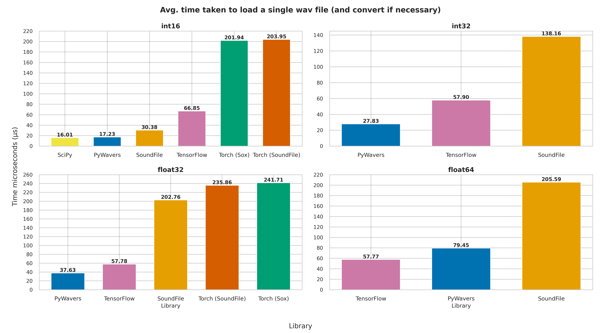
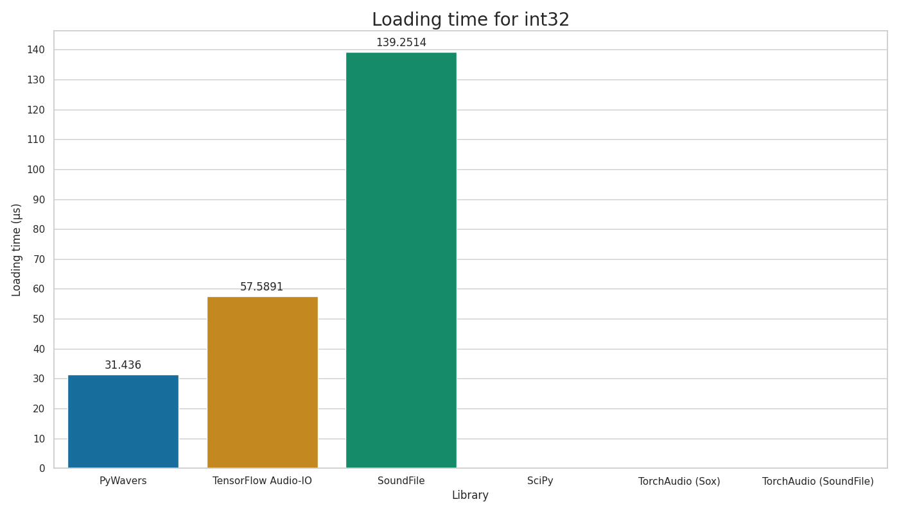
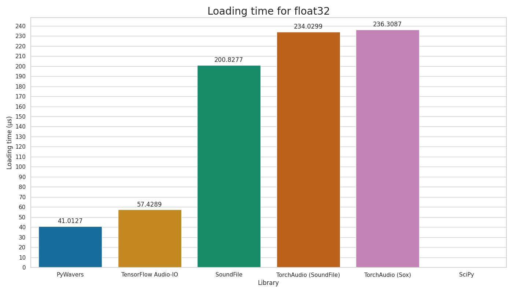
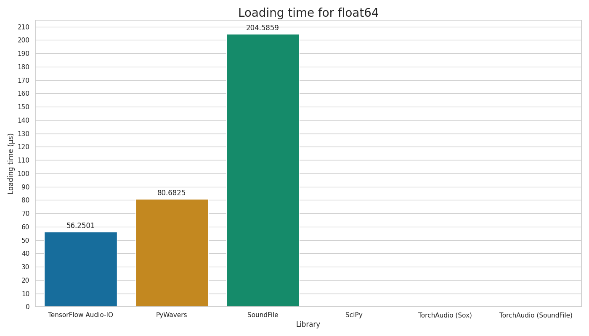

<h1>PyWaveRS - WaveRs but for Python</h1>

**
 [![crate-pywavers-img]][crate-pywavers] [![crate-pywavers-docrs-img]][pywavers-docrs] [![crate-pywavers-readdocs-img]][pywavers-readdocs] [![Crates.io][crate-img]][crate] [![Documentation][docs-img]][docs] 
**

[crate-pywavers]: https://github.com/jmg049/pywavers

[crate-pywavers-img]: https://img.shields.io/badge/PyWavers-56B4E9?style=for-the-badge&labelColor=gray

[crate-pywavers-docrs-img]: https://img.shields.io/badge/Docs-56B4E9?style=for-the-badge&labelColor=gray

[crate-pywavers-readdocs-img]:  https://img.shields.io/badge/Read_The_Docs-56B4E9?style=for-the-badge&labelColor=gray

[crate]:         https://crates.io/crates/wavers

[crate-img]:     https://img.shields.io/badge/WaveRs-009E73?style=for-the-badge&labelColor=gray

[docs-img]:      https://img.shields.io/badge/docs-009E73.svg?style=for-the-badge&labelColor=gray

[docs]:          https://docs.rs/wavers

[pywavers-readdocs]: https://readthedocs.org/projects/pywavers

[pywavers-docrs]: https://docs.rs/pywavers

    <strong>
	WaveRs (pronounced wavers) is a Wav file reader/writer written in Rust and designed to fast and easy to use. WaveRs is also available in Python through the PyWaveRs package. 
    </strong>

    <h3>
        <a href="https://docs.rs/wavers">Getting Started</a>
         · 
        <a href="">Benchmarks</a>
    </h3>

---

# Getting Started

## Benchmarks

| dtype   |   PyWavers |   SoundFile |    SciPy |   TorchAudio (Sox) |   TorchAudio (SoundFile) |   TensorFlow Audio-IO |
|---------|------------|-------------|----------|--------------------|--------------------------|-----------------------|
| int16   |    17.5396 |      30.319 |  16.4971 |            210.996 |                  200.896 |               65.6674 |
| int32   |    31.436  |     139.251 | nan      |            nan     |                  nan     |               57.5891 |
| float32 |    41.0127 |     200.828 | nan      |            236.309 |                  234.03  |               57.4289 |
| float64 |    80.6825 |     204.586 | nan      |            nan     |                  nan     |               56.2501 |

All times in microseconds &micros and are the time taken (on average) to load a single file from the list of files

< EXPLAIN NANs here >

<figure>
    
    <figcaption>Benchmark results for reading PCM-16 encoded wav files.</figcaption>
</figure>

<!-- 

<figure>
    
    <figcaption>Benchmark results for reading PCM-32 encoded wav files.</figcaption>
</figure>

<figure>
    
    <figcaption>Benchmark results for reading Float32 encoded wav files.</figcaption>
</figure>

<figure>
    
    <figcaption>Benchmark results for reading Float64 encoded wav files.</figcaption>
</figure>

 -->